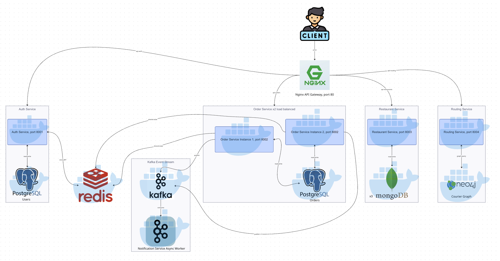

# MealMate

[](https://github.com/code1715/mealmate/actions/workflows/ci.yml)

> A microservices-based food delivery platform (Glovo / UberEats analogue) connecting customers, restaurants, and couriers.

## Architecture



## Tech Stack

| Component | Technology |
|---|---|
| Language | Python 3.12 + FastAPI |
| Auth store | Postgres + Redis |
| Order store | Postgres |
| Restaurant catalog | MongoDB (3-node Replica Set) |
| Courier graph | Neo4j |
| Event streaming | Kafka + Zookeeper |
| API Gateway | Nginx |
| Containerization | Docker + Docker Compose |

## Services

All services are accessed through the API Gateway on port **80**.

| Service | Route prefix | Description |
|---|---|---|
| Auth | `/api/auth/` | Registration, login/logout, JWT validation |
| Order | `/api/orders/` | Order lifecycle and status management (2 instances) |
| Restaurant | `/api/restaurants/` | Restaurant catalog and menus |
| Routing | `/api/routing/` | Courier matching via graph queries |
| Notification | Kafka consumer | Async push notifications |

## Prerequisites

- Docker
- Docker Compose

## Running Locally

```bash
git clone https://github.com/code1715/mealmate.git
cd mealmate

# Build and start all services and infrastructure
docker compose up --build
```

**MongoDB replica set and Kafka topics are initialized automatically** by the
`mongo-init` and `kafka-init` containers on first startup — no manual step required.

**Neo4j graph schema and seed data are initialized automatically** by the
`neo4j-seed` container on first startup (zones, restaurants, couriers with
`LOCATED_IN` relationships). The script is idempotent — safe to re-run.

To run only infrastructure (databases, Kafka, Redis) without application services:

```bash
docker compose up postgres-auth postgres-orders mongo1 mongo2 mongo3 redis kafka neo4j
```

## Ports

All application traffic goes through the API Gateway on port **80**.
Infrastructure services are exposed for debugging:

| Service | Host port |
|---|---|
| API Gateway | 80 |
| Auth Postgres | 5432 |
| Orders Postgres | 5433 |
| MongoDB primary | 27017 |
| MongoDB replica 2 | 27018 |
| MongoDB replica 3 | 27019 |
| Redis | 6379 |
| Kafka | 9092 |
| Neo4j browser | 7474 |
| Neo4j bolt | 7687 |

Neo4j credentials: `neo4j` / `mealmate`

## API Contracts

All service interfaces — request/response shapes, status codes, and Kafka event schemas — are documented in [`docs/api-contracts.md`](docs/api-contracts.md).

## Project Structure

```
services/
  auth/          # FastAPI — Postgres + Redis
  order/         # FastAPI — Postgres + Kafka producer
  restaurant/    # FastAPI — MongoDB
  routing/       # FastAPI — Neo4j
  notification/  # FastAPI — Kafka consumer
api-gateway/     # Nginx config
docker/          # Dockerfiles and init scripts
docs/            # Architecture diagram, use cases, API contracts
```

## Team

| Developer    | Responsibilities                                                                |
|--------------|---------------------------------------------------------------------------------|
| Yehor Mets   | Infrastructure, Docs, Routing Service, Restaurant Service, Notification Service |
| Bohdan Dyhas | Auth Service, Order Service, API Gateway                                        |